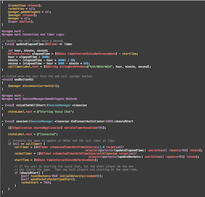
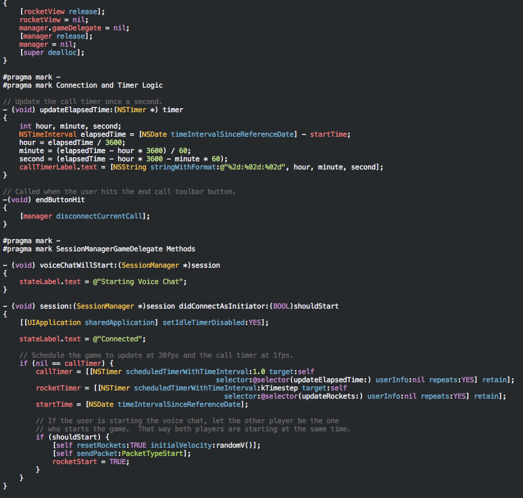
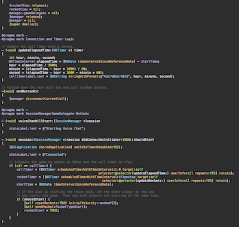
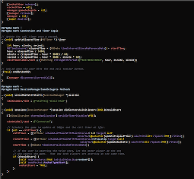
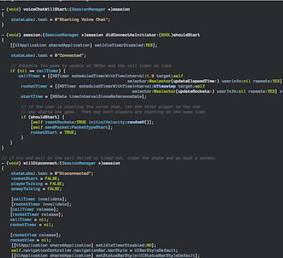
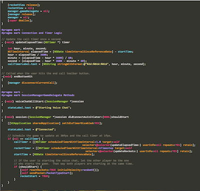
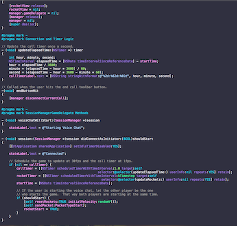
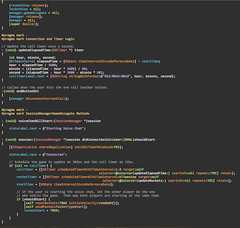
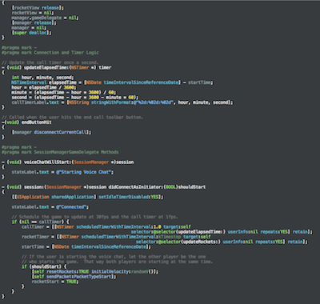

Xcode 4 Themes
==============

![Humane (Modified)] [humane_image]
![Solarize Light] [light]
![Solarize Dark] [dark]
![Obsidian] [ob]

Installation
------------

git clone git@github.com:jbrennan/xcode4themes.git
mkdir -p ~/Library/Developer/Xcode/UserData/FontAndColorThemes/
cp *.dvtcolortheme ~/Library/Developer/Xcode/UserData/FontAndColorThemes/

   [script]: http://digitalflapjack.com/blog/2011/jan/24/xcodedpthemes/
   [humane]: http://damieng.com/blog/2008/02/08/humane-theme-for-textmate-and-xcode
   [solar]: http://ethanschoonover.com/solarized
   [varikin]: https://github.com/varikin/solarized/tree/master/xcode4-colors-solarized
   [dark]: http://farm6.static.flickr.com/5062/5592270855_1b26fb726e_o.png  "Solarize Dark"
   [light]: http://farm6.static.flickr.com/5030/5592863390_04967685db_o.png  "Solarize Light"
   [humane_image]: http://farm6.static.flickr.com/5306/5592861916_4db32fe976_o.png  "Humane (Modified)"
   [obsidian_xcode_3]: https://gist.github.com/837656
   [ob]: https://img.skitch.com/20110220-qhusp5yejyp6t3k9kkajddi14x.jpg